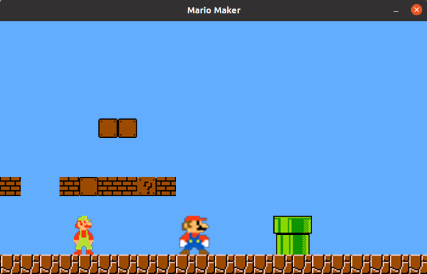

# Mario Maker

Trying to replicate super mario maker with c++ and raylib.

# Table of contents

- [Quick Start](#quick-start)
- [Creating your own map](#creating-your-own-map)
- [Todos](#todos)

# Quick start 

In order to compile and build the game, the project is provided with a `CMakeList.txt` file, so 
you just need to run:
    
    mkdir build && cd build
    cmake .. 

Additional args could be:

- `-G <Type_of_generator>`

- `-DTMXLITE_INCLUDE_DIR=<your_path_to_txmlib_include>`, the path to the txmlite library, that I've used to parse
the tmx files which contains the structure of the map. 
  
If you're using **CLion** I've included the `./idea` folder, which can help you setting up and build the project.

# Libraries used

- [Raylib](https://github.com/raysan5/raylib) -  used as a framework to build the game
- [Gtest](https://github.com/google/googletest) - used for testing (is install when running the `cmake`)
- [tmxlite](https://github.com/fallahn/tmxlite) - for parsing the txm file used for the map
- [rededev/ECS](https://github.com/redxdev/ECS) - an header only entity component system library (already included)

Since `rededev/ECS` is already included and `Google test` is installed with cmake,
the only two libraries you need to install are Raylib and tmxlite.

## Installing txmlite

### Windows with MinGW

Download git repo:

    git clone https://github.com/fallahn/tmxlite.git
    
Then execute the following command in order to build the library:

    cd tmxlite && cd tmxlite && mkdir build && cd build
    
    # in the build folder run:
    
    cmake .. -G "MinGW Makefiles" 
    
After that, run as an admin the following command:

    mingw32-make clean && mingw32-make install

And now you should have installed the library, just make sure that you 
set the `-DTMXLITE_INCLUDE_DIR` variable when running the CMake file.

### Linux

After you download the repo, using the command listed above run

    cd tmxlite && mkdir build && cd build
    cmake ..
    sudo make install
    
After that you should be done.

# Creating your own map

**Todo**: Explain how to create a map with tiled

# Todos 

- [ ] Implement enemies
- [ ] fix animation of brick breaking
- [ ] Improve collision system
- [ ] Sounds and music

# Author

Paolo D'Elia

# License

MIT