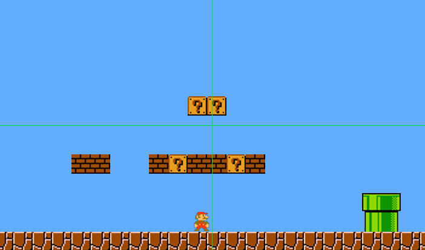

# Mario Maker

Making super mario maker with c++

# Quick start 

Cmake args needed 

    -DTMXLITE_INCLUDE_DIR=<your_path_to_txmlib_include>

# Libraries used

- [Raylib](https://github.com/raysan5/raylib) - as a framework to build the game
- [Gtest](https://github.com/google/googletest) - used for testing
- [tmxlite](https://github.com/fallahn/tmxlite) - for parsing the txm file used for the map
- [rededev/ECS](https://github.com/redxdev/ECS) - an header only entity component system library

## Installing txmlite

### Windows with MinGW

Download git repo:

    git clone https://github.com/fallahn/tmxlite.git
    
Then execute the following command in order to build the library:

    cd tmxlite && cd tmxlite && mkdir build && cd build
    
    cd build && cmake .. -G "MinGW Makefile" 
    
Run as an admin the following command:

    mingw32-make clean && mingw32-make install

And now you should have installed the library, just make sure that you 
set the `-DTMXLITE_INCLUDE_DIR` variable when running the CMake file.

### Linux

After you download the repo, using the command listed above run

    cd tmxlite && mkdir build && cd build
    cmake ..
    sudo make install
    
After that you should be done.

# Author

Paolo D'Elia