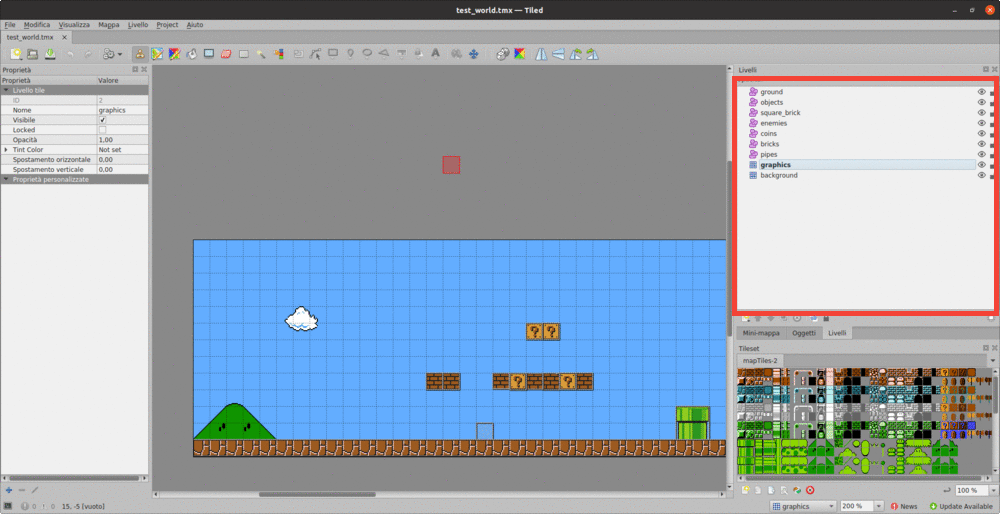
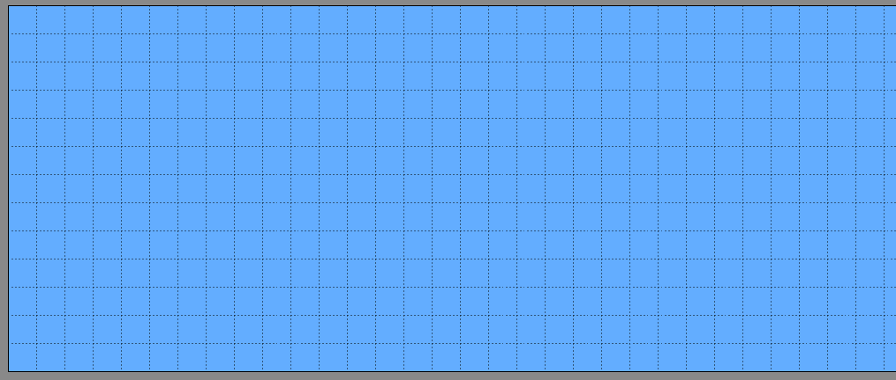
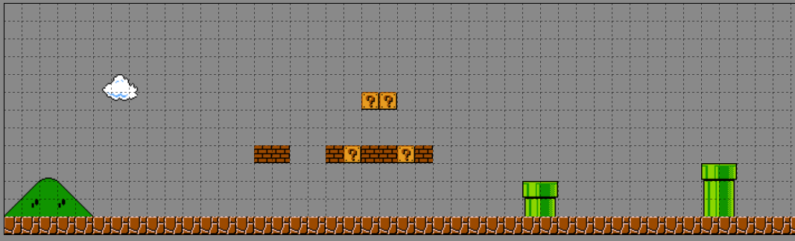
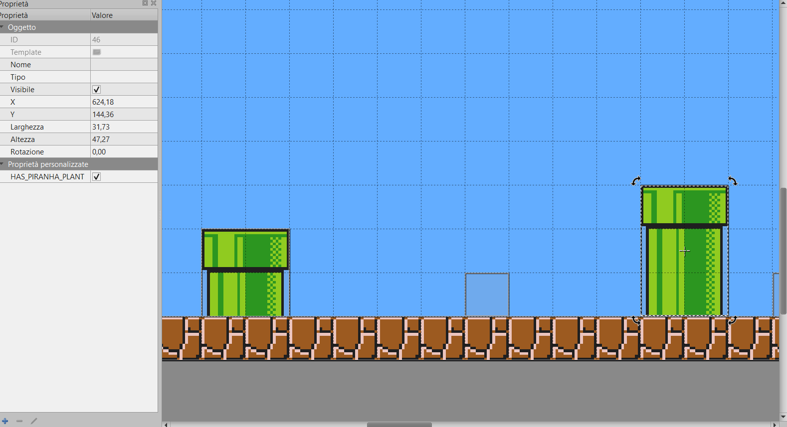

# Mario Maker

A clone of mario maker made with no game engine, just with C++ and Raylib.

The main architectural/design pattern used to build the game is the [ECS](https://en.wikipedia.org/wiki/Entity_component_system).

# Table of contents

- [Quick Start](#quick-start)
- [Libraries Used](#libraries-used)  
- [Creating your own map](#creating-your-own-map)
- [Contributing](#Contributing)

# Quick start 

In order to compile and build the game, the project is provided with a `CMakeList.txt` file, so 
you just need to run:
    
    mkdir build && cd build
    cmake .. 

Additional args could be:

- `-G <Type_of_generator>`

- `-DTMXLITE_INCLUDE_DIR=<your_path_to_txmlib_include>`, the path to the txmlite library, that I've used to parse
the tmx files which contains the structure of the map. 
  
If you're using **CLion** I've included the `./idea` folder, which can help you setting up and build the project.

## Run the game

    path_to_build/mario_maker <path_map_to_load>

Where the `path_map_to_load` is relative to the build folder. So, for example, it could be `../assets/maps/map_1.tmx`.

## Commands

The first player's commands are:

  - `↑ ↓ ← →`: to move the player (`↑` is for jump)
  - `z` for shooting the fireball we mario is Flame mode
  - `left_shift` for sprinting

The second player's commands are:

- `w a s d`: to move the player (`w` is for jump)
- `f` for shooting the fireball we mario is Flame

> For handling the second player I'm planning to use the joystick/gamepad, but for the time being, on linux 
> the Raylib's gamepad handler is not working (on Windows it works!)

# Libraries used

- [Raylib](https://github.com/raysan5/raylib) -  used as a framework to build the game (is install when running the `cmake`)
- [tmxlite](https://github.com/fallahn/tmxlite) - for parsing the txm file used for the map
- [rededev/ECS](https://github.com/redxdev/ECS) - an header only entity component system library (already included)

Since `rededev/ECS` is already included and `Raylib` (if it's not installed) is 
installed with cmake, the only library that you need to install is tmxlite.

## Installing txmlite

### Windows with MinGW

Download git repo:

    git clone https://github.com/fallahn/tmxlite.git
    
Then execute the following command in order to build the library:

    cd tmxlite && cd tmxlite && mkdir build && cd build
    
    # in the build folder run:
    
    cmake .. -G "MinGW Makefiles" 
    
After that, run as an admin the following command:

    mingw32-make clean && mingw32-make install

And now you should have installed the library, just make sure that you 
set the `-DTMXLITE_INCLUDE_DIR` variable when running the CMake file.

### Linux

After you download the repo, using the command listed above run

    cd tmxlite && mkdir build && cd build
    cmake ..
    sudo make install
    
After that you should be done.

# Creating your own map

The maps of the game are created using [Tiled](https://www.mapeditor.org/),
which is a 2d open source Map editor. The file format used for storing the map is .tmx, 
which is based on XML, is easy to understand, and allows multiple tilesets to be used in any map. 
The first thing to note is that the map is composed of layers,

which in this case are:

- a **Background layer**: the ***tile layer*** which contains all the tiles of the background of the level

- a **Graphics layer**: the ***tile layer*** which contains the majority of the tiles (ground's tiles, bricks' tiles, 
  and so on) which are part of the levels

- an **Enemies layer**: the ***object layer*** which contains all the enemies, represented by their AABB( or more 
  simply their collision box), and their Type. Currently, the enemies implemented are:
  - GOOMBA
  - KOOPA_TROOPA
  - TARTOSSO
  - THWOMP_V (Thwomp with vertical movement)
  - THWOMP_V (Thwomp with horizontal movement)
  - PIRANHA_PLANT
  - BLACK_CANNON, which must have another property **bulletType** which is the 
  type of bullet its shoot. The values that bulletType can have are: B_BULLET_BILL, GOOMBA, SUPER_MUSHROOM, ONE_UP_MUSHROOM
  
  - While additional properties that can be added to enemies are:
    - isBig : **bool** make the enemy bigger
    - hasParachute: **bool** equip the enemy with a parachute (works only with the entities that have a Gravity Component)
    - left: **bool** property which make Vertical Thwomp go to the left
    
- an **Object layer**: the ***object layer*** which contains all the objects which are not present in the tileset, but 
they are present in the object tileset. Those objects may be, for example, the final flag pole, the various checkpoints, and 
others additional objects that can enrich the map.
- a **Pipe Layer**: the ***object layer*** wraps all the pipes which are present in the graphics layer making them collidable 
with the other game's entities. Additionally, they can have the bool prop `has_piranha_plant`, which when is true, it makes periodically
pop out the piranha plant from the pipe

- a **Ground layer**: the ***object layer*** which wraps all the grounds tiles of the graphics layer, making them collidable entities. 
- a **Bricks layer**: the ***object layer*** which wraps all the brick tiles of the graphics layer, making them collidable entities.
- a **Square Bricks layer**: the ***object layer*** which wraps all the square bricks tiles of the graphics layer, making them collidable entities.
- a **Question Block layer**:  the ***object layer*** which wraps all the question mark tiles of the graphics layer, making them collidable entities.
The additional properties that an object, in this layer, can have are the following:
    - **coins**: bool prop which when is true means that the question mark block have a coin in it
    - **super_mario_mushroom**: bool prop which when is true means that the question mark block have the super mario mushroom in it
    - **flame_mushroom**: bool prop which when is true means that the question mark block have the flame mushroom/flower in it
    - **mega_mushroom**: bool prop which when is true means that the question mark block have the mega mushroom in it
    - **one_up_mushroom** bool prop which when is true means that the question mark block have the one up mushroom in it
    

The additional props that the map itself must have are:

- **spawn_mario_x**: the x coordinate (an **int**) of the position on the map where to spawn the first player (who is Mario) 
- **spawn_mario_y**: the y coordinate (an **int**) of the position on the map where to spawn the first player 

For those who don't know the (0, 0) position is the square at the top left, and the x increases by going on the right 
while y increases by going down.
So you have to choose the spawn position according to that coordinate system.

# Contributing

Contributors are welcome! But before you do it check out the [guidelines](docs/CONTRIBUTING.md).

# Author

Paolo D'Elia

# License

MIT